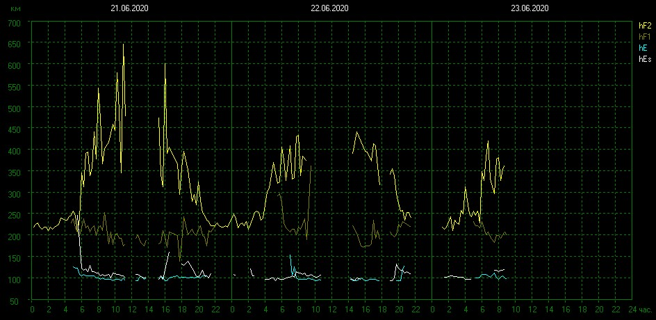

<!DOCTYPE html><meta charset="utf8"/>

## Status of our planet (Schumann Resonances)

$Date: Wed Jun 24 12:09:12 CEST 2020 $ 
$GITid: 1fda3f8 $ (previous) 

SPGRM: 
 
 

 
 
 
 

 
 

 
 
 
 
 

--&nbsp; 
this file: [schumann-reson.html](schumann-reson.html) (previous: [1fda3f8](https://github.com/Advancement-of-Civilization-Effort/NOCC/blob/1fda3f8/schumann-reson.html))
(is also on IPNS: [QmYHfWp8NjSJ9gBEiDotXFvhbospMv8FLSwmAKGe5RnT9q](https://gateway.ipfs.io/ipns/QmQE42Qy1VD9AE6eYc2skE5xujsgJ3edbG2AiC1Y3eFDHv))

