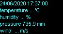
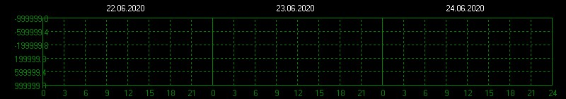

<!DOCTYPE html><meta charset="utf8"/>

## Status of our planet (Schumann Resonances)

$Date: Mon Apr  6 11:38:03 CEST 2020 $ 
$GITid: f173d2f $ (previous) 

SPGRM: 

 
 

 
 
 
 

 
 

 
 
 
 
 

--&nbsp; 
this file: [schumann-reson.html](schumann-reson.html) (previous: [f173d2f](https://github.com/Advancement-of-Civilization-Effort/NOCC/blob/f173d2f/schumann-reson.html))
(is also on IPNS: [QmYHfWp8NjSJ9gBEiDotXFvhbospMv8FLSwmAKGe5RnT9q](https://gateway.ipfs.io/ipns/QmQE42Qy1VD9AE6eYc2skE5xujsgJ3edbG2AiC1Y3eFDHv))

